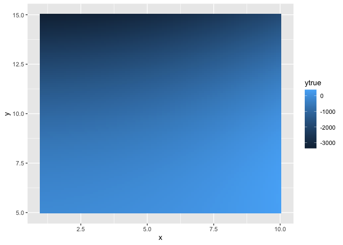
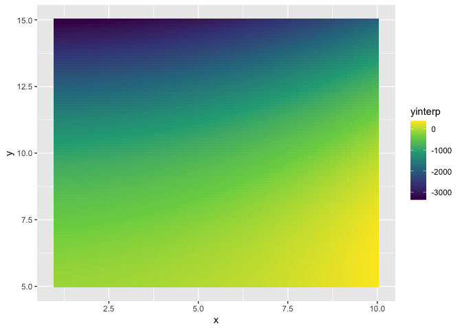

<!-- README.md is generated from README.Rmd. Please edit that file -->

# flatlandr

<!-- badges: start -->
<!-- badges: end -->

This package provides functions for chebyshev interpolation in 2
dimensions

## Installation

You can install the development version from
[GitHub](https://github.com/) with:

``` r
# install.packages("devtools")
devtools::install_github("mdgordo/flatlandr")
```

## Example

``` r
library(flatlandr)

## function for interpolation:
fxy <- function(x, y) {
  r = log(x) + x^2*y - y^3
  return(r)
}

### create 10 nodes in each dimension on (0,10) and (5,15)
lb = c(1,5)
ub = c(10,15)
ss = chebstatespace(10, lb, ub)

### apply function
y = mapply(fxy, ss$x, ss$y)
y = matrix(y, ncol = 10)

### find coefficient matrix
cmat = chebcoefs(y, degree = 5)

### interpolate
chebpred(2.5, 10.3, cmat, lb, ub)
#> [1] -1027.437
fxy(2.5, 10.3)
#> [1] -1027.436
```

Test and plot interpolations vs true value

``` r
library(tidyverse)
#> ── Attaching packages ─────────────────────────────────────── tidyverse 1.3.1 ──
#> ✓ ggplot2 3.3.5     ✓ purrr   0.3.4
#> ✓ tibble  3.1.3     ✓ dplyr   1.0.7
#> ✓ tidyr   1.1.3     ✓ stringr 1.4.0
#> ✓ readr   1.4.0     ✓ forcats 0.5.1
#> ── Conflicts ────────────────────────────────────────── tidyverse_conflicts() ──
#> x dplyr::filter() masks stats::filter()
#> x dplyr::lag()    masks stats::lag()

x = seq(1,10,.1); y = seq(5,15,.1)
df.test <- crossing("x" = x, "y" = y)

df.test$ytrue <- mapply(fxy, df.test$x, df.test$y)
df.test$yinterp <- mapply(chebpred, x = df.test$x, y = df.test$y, coefmat = list(cmat), lb = list(lb), ub = list(ub))

ggplot(df.test) + 
  geom_tile(aes(x = x, y = y, fill = ytrue))
```



``` r
ggplot(df.test) + 
  geom_tile(aes(x = x, y = y, fill = yinterp))
```



Reference: Judd, Kenneth. (1998). “Numerical Methods in Economics.” MIT
Press. p238.
